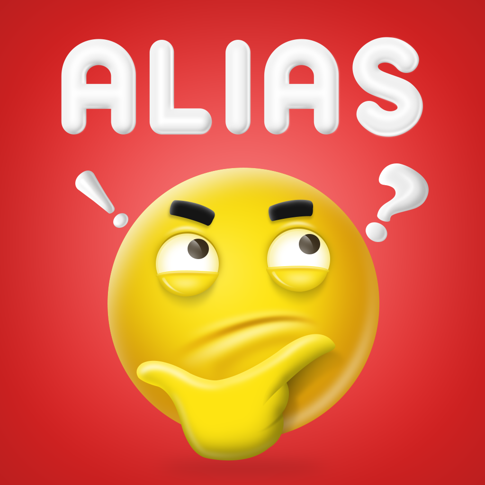
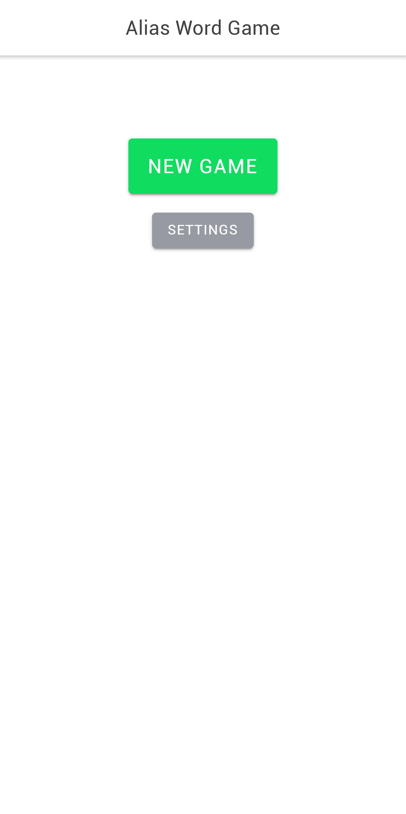
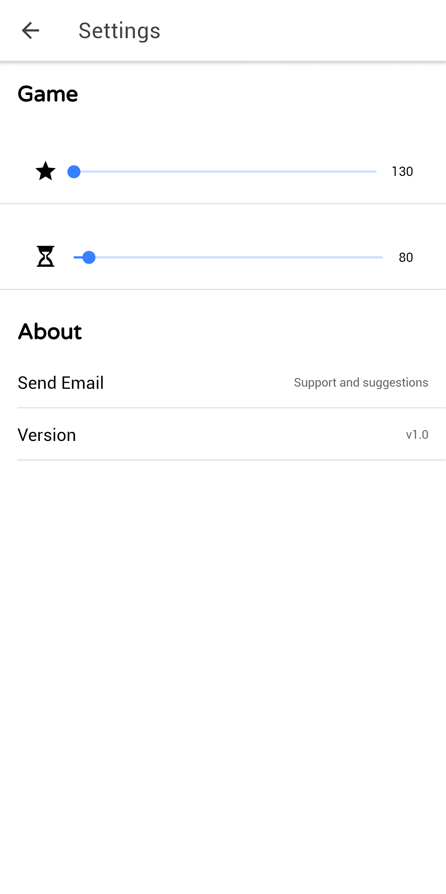
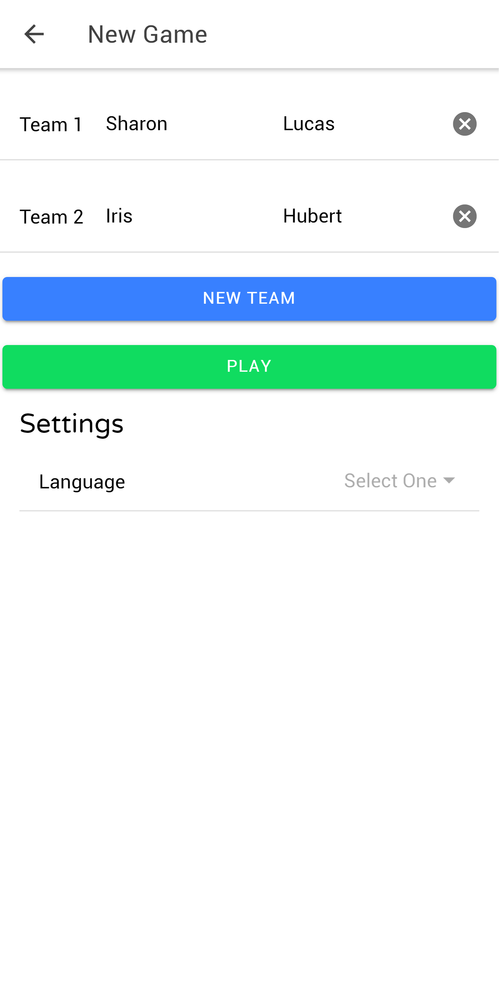
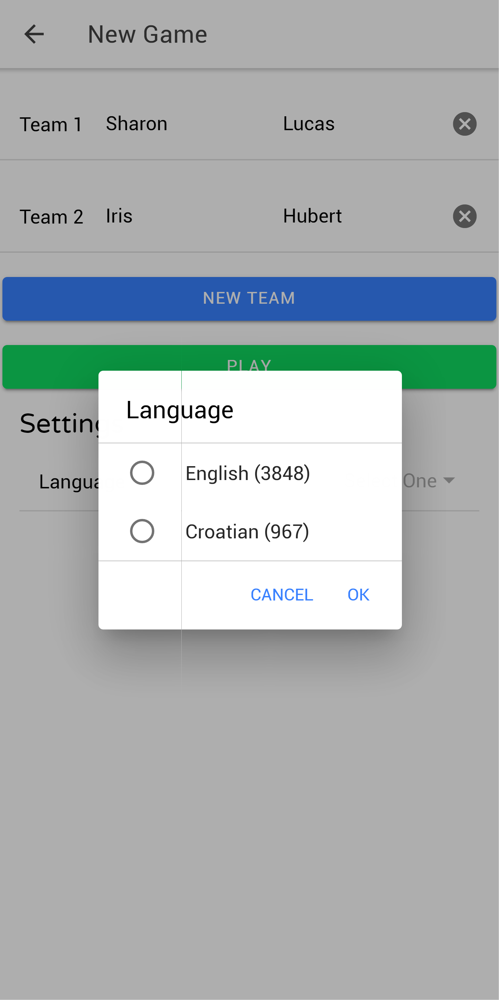
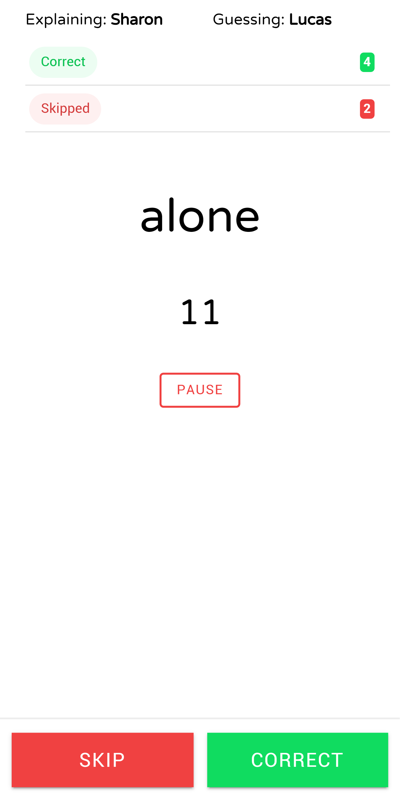
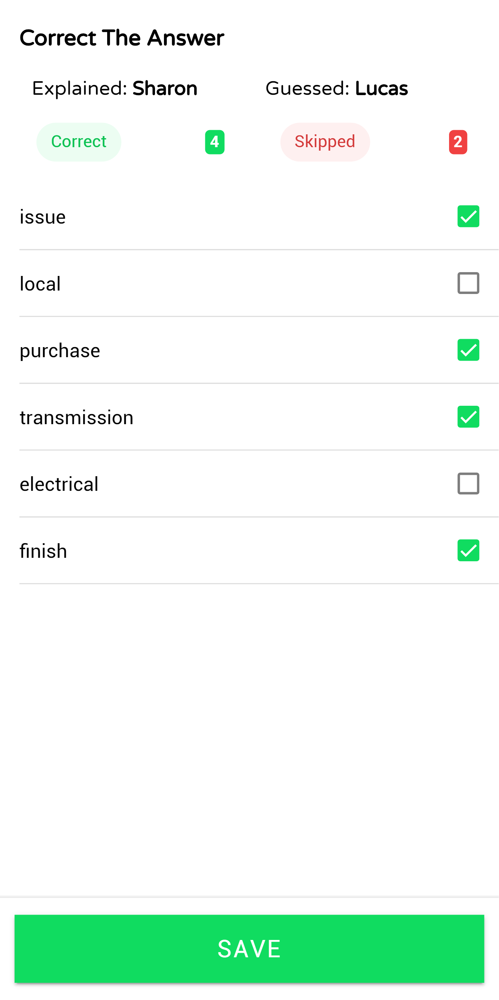

 
<h2 align="center"><b>Alias</b></h2>
<h4 align="center">Hybrid mobile board game</h4>

 <a href="https://play.google.com/store/apps/details?id=com.stjepan.alias" alt="Google play release"> 

## Screenshots

## Description
Alias is a fun word explanation game that is played in teams of 2 or more people. 

The aim is to make your teammates guess the word you are explaining by giving them hints and tips. 

For each correct guess the team moves forward on the game board, and the team that reaches the finish space first wins the game!

Score points! Guess words and get points.
